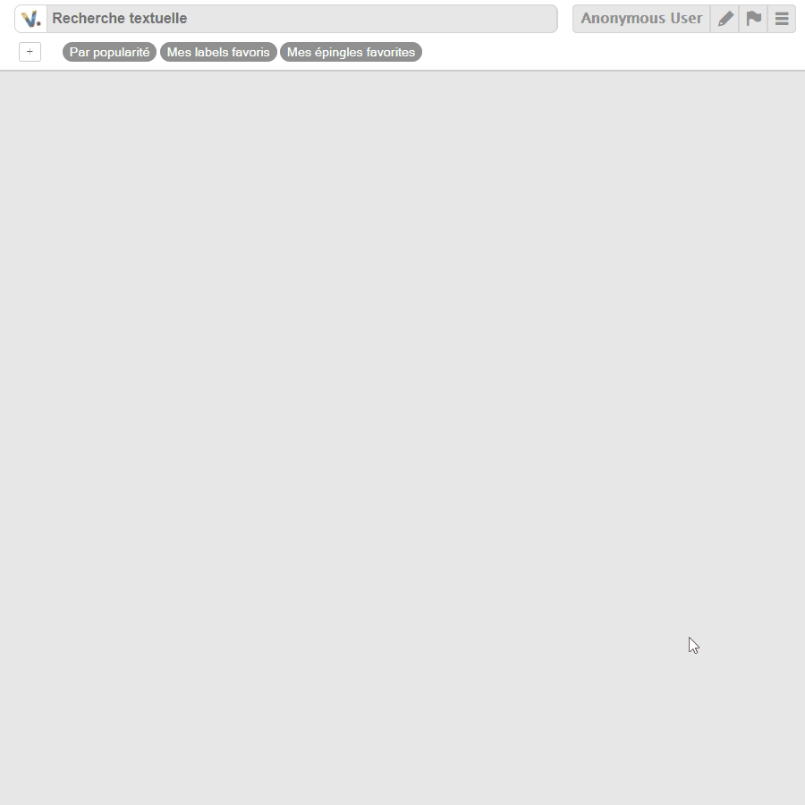

-> come look at our [good first issues](https://github.com/voyages-sncf-technologies/vboard/issues?q=is%3Aissue+is%3Aopen+label%3A%22good+first+issue%22)

Dependency analysis:  (npm) <!-- (Maven)-->

V.Board is an information sharing app. It allows users to share "pins", that is byte-size pieces of information: an URL, a picture and a short description.
V.Board is designed to be used for communication among an organization teams: project advancement, technology watch, etc.

This software has been used at oui.sncf since July 2016.
The public, open-source version of this project was published in January 2018. It's current status is: **INCUBATING**

Online demo instance: <https://vboard-demo.herokuapp.com>

<!-- toc -->

- [Features](#features)
- [Usage](#usage)
- [Contributing](#contributing)
- [Architecture](#architecture)
  * [Authentication](#authentication)

<!-- tocstop -->

# Features
- a complete [Pinterest](https://www.pinterest.com)-like editable dashboard,
with comments and a search bar
- a "labels" system, with per-user favorites and notifications
- a "likes" system
- per-user configuration of an avatar, a team, a description...
- simple gamification, badges & leaderboard
- fully dockerized
- optional email notifications
- integrate with [KeyCloack](http://www.keycloak.org) or [AWS Cognito](https://aws.amazon.com/cognito/) for identity & access management
- a REST API
- a RSS feed

# Usage
The following command starts V.Board locally :

    export TAG=latest
    docker-compose build
    docker-compose -f docker-compose.yml -f docker-compose.dev.yml up -d --no-build

You can then access the website through http://localhost
and the swagger at http://localhost/api/v1/swagger-ui/

# Contributing

Want to report a bug ? Suggest a feature ? Give us a hand ?
Go have a look at our [CONTRIBUTING.md](CONTRIBUTING.md) guide.

# Architecture
V.Board is made of the folling modules, launched as `docker-compose` services:

- `ws`: [SpringBoot](https://projects.spring.io/spring-boot/) REST web service (backend)
- `front`: [AngularJS](https://angularjs.org) 1.5 web app served by Apache (front)
- `batchs`: [logstash](https://www.elastic.co/fr/products/logstash) cron to update the ElasticSearch index from the database

## Docker services
Some extra `docker-compose` services are used:

- `elasticsearch`: a standard Elasticsearch instance
- `wsdb`: MySQL database for the backend

There are also some volumes used by the stack:

- `images`: contains all images for vboard pins and users
It is shared between the `ws` and `front` services: `ws` writes in it and `front` reads from it.
- `wsdb-data`: contains the backend database

## Authentication
There are 3 supported mode of authentication, that are activated in this order:

- through a [Keycloak instance](https://www.keycloak.org), if the environment variables `$KCK_ENABLED`, `$KCK_PUBLIC_HOST` & `$KCK_REALM_KEY` are defined,
_cf_. [KeycloakEnabledInEnv.java](https://github.com/voyages-sncf-technologies/vboard/blob/master/vboard-ws/src/main/java/com/vsct/vboard/config/KeycloakEnabledInEnv.java)
- through [AWS Cognito](https://aws.amazon.com/fr/cognito/), with a `X-AMZN-OIDC-DATA` HTTP header containing a JWT token,
if the environment variable `$AWS_COGNITO_ENABLED` is defined
- anonymous mode

## Alternative software

- https://tildes.net
- https://postmill.xyz
